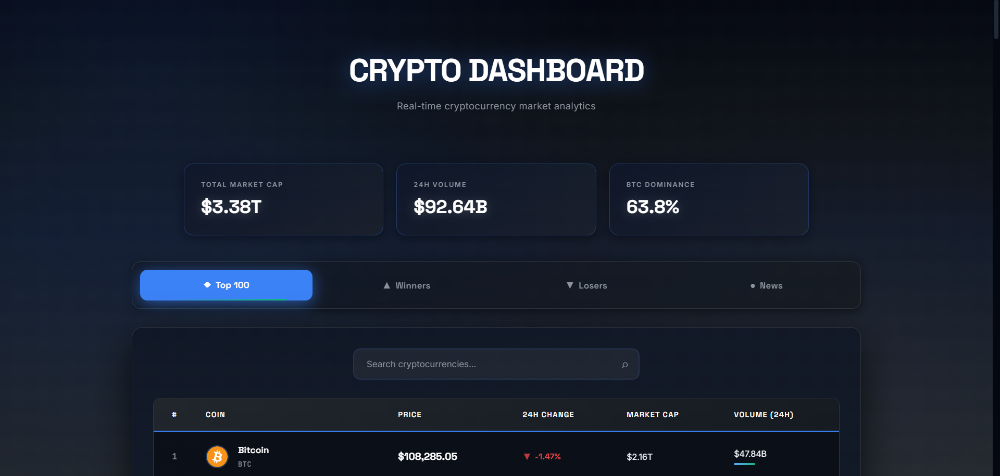

# 🚀 Crypto Market Dashboard



A professional, real-time cryptocurrency market dashboard featuring live price tracking, market analytics, and interactive charts. Built with vanilla JavaScript, this responsive web application provides a sleek, modern interface for monitoring the top 100 cryptocurrencies.

[](https://crypto-dashboard-rho-five.vercel.app/)
[](LICENSE)

## 🌟 Features

### 📊 Real-Time Market Data
- **Live Price Tracking**: Real-time cryptocurrency prices powered by CryptoCompare API
- **Market Statistics**: Total market cap, 24h volume, and BTC dominance metrics
- **Auto-Refresh**: Data updates automatically every 3 minutes
- **Fallback System**: Automatic fallback to sample data if API is unavailable

### 📈 Multiple Views
- **Top 100**: Complete overview of top cryptocurrencies by market cap
- **Winners**: Top gainers sorted by 24h price change
- **Losers**: Biggest losers sorted by 24h price change
- **News**: Curated cryptocurrency news and updates

### 🎯 Interactive Features
- **Click-to-Chart**: Click any cryptocurrency to open detailed TradingView charts in a new tab
- **Search Functionality**: Real-time search across all tabs to find specific coins
- **Responsive Design**: Fully optimized for desktop, tablet, and mobile devices
- **Smooth Animations**: Staggered load animations and hover effects for enhanced UX

### 🎨 Professional Design
- **Dark Theme**: Sophisticated grey-dark blue color scheme
- **High Contrast**: Optimized for readability and accessibility
- **Custom Typography**: Three professional fonts (Space Grotesk, Inter, JetBrains Mono)
- **Visual Feedback**: Volume bars, price indicators, and interactive hover states

## 🛠️ Technologies Used

### Frontend
- **HTML5**: Semantic markup
- **CSS3**: Advanced styling with gradients, animations, and transitions
- **Vanilla JavaScript**: No frameworks - pure, performant code

### APIs & Services
- **CryptoCompare API**: Real-time cryptocurrency data
- **TradingView**: Interactive price charts
- **Vercel**: Deployment and hosting

### Fonts
- **Space Grotesk**: Headers and emphasis
- **Inter**: Body text and UI elements
- **JetBrains Mono**: Numbers and technical data

## 🚀 Live Demo

**[View Live Dashboard →](https://crypto-dashboard-rho-five.vercel.app/)**

## 📸 Screenshots


*Main dashboard with top 100 cryptocurrencies*


*Top gainers with positive price movements*


*Cryptocurrency news and updates*

## 💻 Installation & Usage

### Quick Start

1. **Clone the repository**
   ```bash
   git clone https://github.com/Rado4200/crypto-dashboard.git
   cd crypto-dashboard
   ```

2. **Open in browser**
   ```bash
   # Simply open the HTML file
   open crypto-dashboard-professional.html
   
   # Or serve with Python
   python -m http.server 8000
   # Then visit http://localhost:8000
   ```

### No Build Process Required
This is a pure HTML/CSS/JS application with no dependencies or build tools needed. Just open the file in any modern browser!

## 📁 Project Structure

```
crypto-dashboard/
├── crypto-dashboard-professional.html   # Main application file
├── main.png                             # Main screenshot
├── screenshots/                         # Additional screenshots
│   ├── overview.png
│   ├── winners.png
│   └── news.png
└── README.md                           # Project documentation
```

## 🔧 Configuration

### API Integration
The dashboard uses CryptoCompare API for real-time data. No API key is required for basic usage.

```javascript
// API Base URL
const API_BASE = 'https://min-api.cryptocompare.com/data';

// Automatic fallback to sample data if API fails
// Ensures the dashboard is always functional
```

### Customization
All styling variables are defined in CSS custom properties for easy customization:

```css
:root {
    --blue-darkest: #050811;
    --grey-dark: #161b22;
    --blue-accent: #3b82f6;
    --green: #10b981;
    --red: #ef4444;
    /* ... more variables */
}
```

## 🎯 Key Features Breakdown

### Market Statistics
- **Total Market Cap**: Aggregated value of all tracked cryptocurrencies
- **24h Volume**: Total trading volume across markets
- **BTC Dominance**: Bitcoin's percentage of total market cap

### Data Visualization
- **Price Charts**: Volume bars showing relative trading activity
- **Change Indicators**: Color-coded positive/negative price movements
- **Animated Rows**: Staggered entrance animations for better UX

### Search & Filter
- **Real-time Search**: Instant filtering across all tabs
- **Symbol & Name Search**: Find coins by ticker or full name
- **Preserved State**: Search works independently on each tab

## 🌐 Browser Support

- ✅ Chrome 90+
- ✅ Firefox 88+
- ✅ Safari 14+
- ✅ Edge 90+
- ✅ Opera 76+

## 📱 Responsive Breakpoints

- **Desktop**: 1400px and above
- **Tablet**: 968px - 1399px
- **Mobile**: Below 968px

## 🔮 Future Enhancements

- [ ] Portfolio tracking feature
- [ ] Price alerts and notifications
- [ ] Historical price charts
- [ ] Favorites/Watchlist system
- [ ] Dark/Light theme toggle
- [ ] Additional exchange integrations
- [ ] Advanced filtering options
- [ ] Multi-language support

## 🤝 Contributing

This is a personal portfolio project, but suggestions and feedback are welcome! Feel free to:

- Report bugs via GitHub Issues
- Suggest features or improvements
- Share your experience using the dashboard

## 📄 License

This project is licensed under the MIT License - see the [LICENSE](LICENSE) file for details.

## 👨‍💻 Author

**Rado4200**

- GitHub: [@Rado4200](https://github.com/Rado4200)
- Portfolio: [Your Portfolio Link]

## 🙏 Acknowledgments

- **CryptoCompare** for providing the cryptocurrency data API
- **TradingView** for interactive charting capabilities
- **Google Fonts** for the beautiful typography
- **Vercel** for seamless deployment and hosting

## 📊 Project Stats

- **Single File Application**: All code in one HTML file for simplicity
- **Zero Dependencies**: No npm packages or build tools required
- **100% Responsive**: Works perfectly on all device sizes
- **Fast Load Time**: Optimized performance with minimal overhead
- **API Fallback**: Always functional, even without internet

---

<div align="center">

**[Live Demo](https://crypto-dashboard-rho-five.vercel.app/)** • **[Report Bug](https://github.com/Rado4200/crypto-dashboard/issues)** • **[Request Feature](https://github.com/Rado4200/crypto-dashboard/issues)**

Made with ❤️ by Rado4200

⭐ Star this repository if you found it helpful!

</div>
